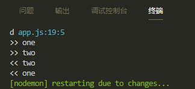

# Koa中间件


## 中间件demo

Koa的中间件是一个级联式（Cascading）的结构，也就是说，属于是层层调用，第一个中间件调用第二个中间件，第二个调用第三个，以此类推。上游的中间件必须等到下游的中间件返回结果，才会继续执行，这点很像递归。

```
var Koa = require('koa');
var http = require('http');

var app = new Koa();

app.use(function *(next) {  //Generator函数的参数next，表示下一个中间件。 Koa要求中间件唯一的参数就是next
    console.log('>> one');
    yield next;   // Generator函数内部使用yield命令，将程序的执行权转交给下一个中间件，即yield next，要等到下一个中间件返回结果，才会继续往下执行。
    console.log('<< one');
})

app.use(function *(next) {
    console.log('>> two');
    this.body = 'two';
    console.log('<< two');
})

app.use(function *(next) {
    console.log('>> three');
    yield next;
    console.log('<< three');
})

app.listen(3000);
// http.createServer(app.callback()).listen(3000)

```




## 多个中间件的合并

由于中间件的参数统一为next（意为下一个中间件），因此可以使用**.call(this, next)**，将多个中间件进行合并。

```
function *random(next) {
    if('/random' == this.path) {
        this.body = Math.floor(Math.random());
    } else {
        yield next;
    }
}

function *backwards(next) {
    if('/backwards' == this.path) {
        this.body = 'sdrawkcab';
    } else {
        yield next;
    }
}

function *pi(next) {
    if('/pi' == this.path) {
        this.body = String(Math.PI);
    } else {
        yield next;
    }
}

function *all(next) {
    yield random.call(this, backwards.call(this, pi.call(this, next)));
}

app.use(all);
```